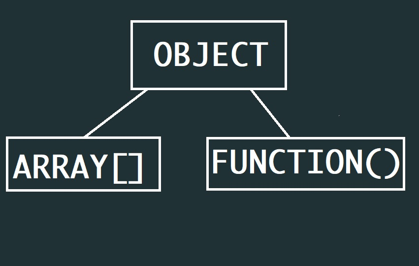
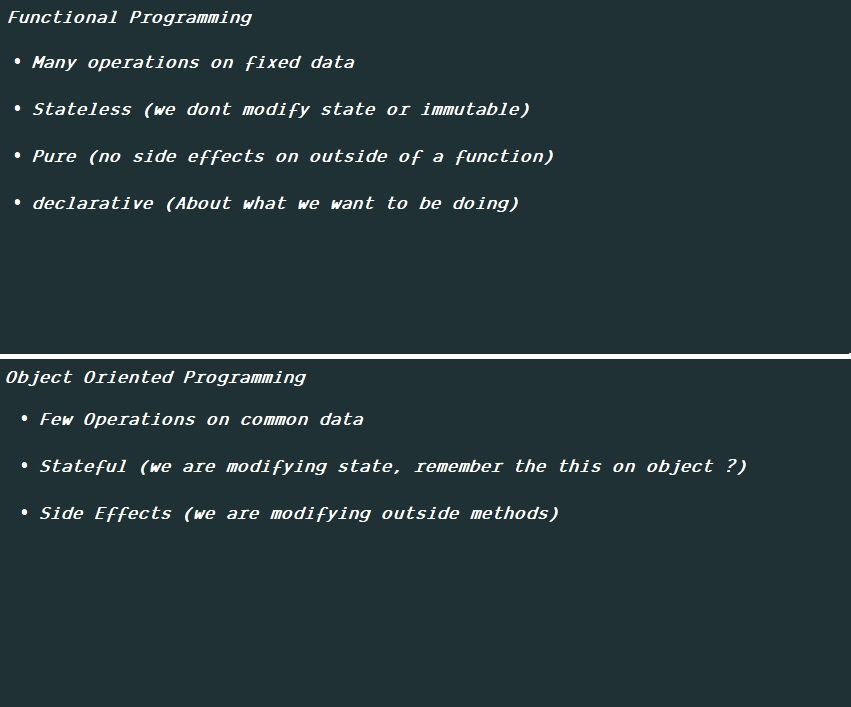
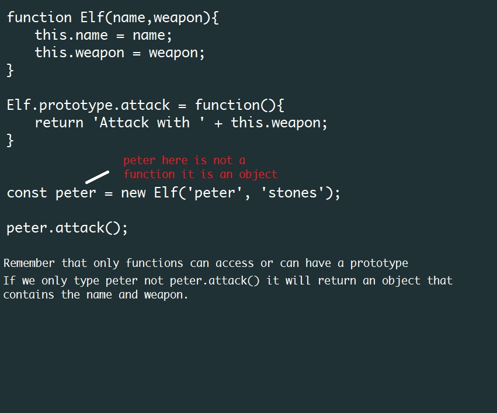
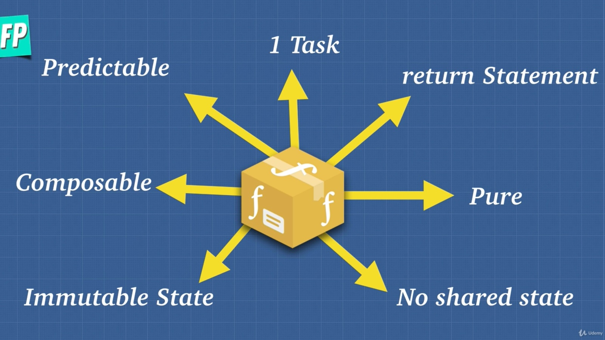
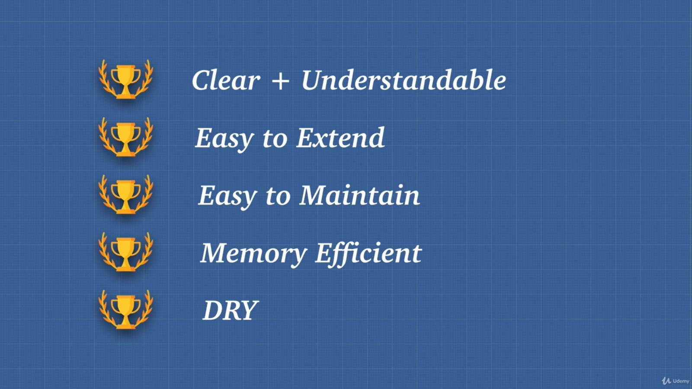
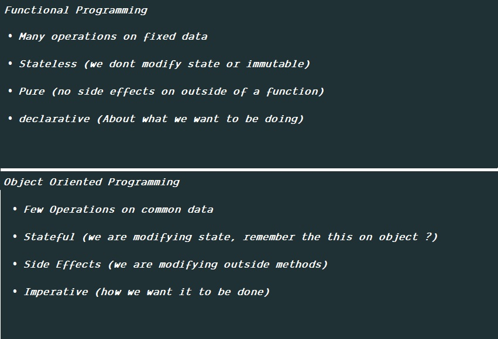
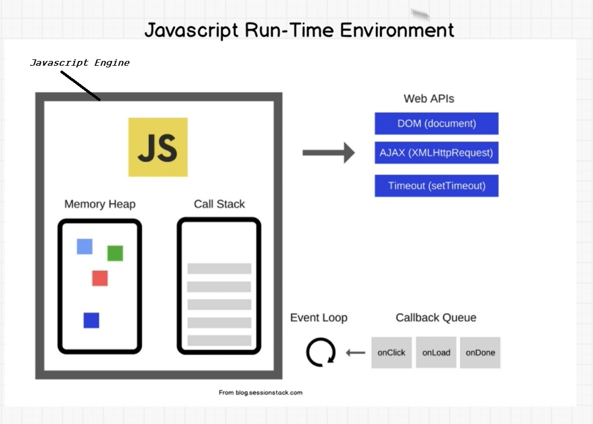
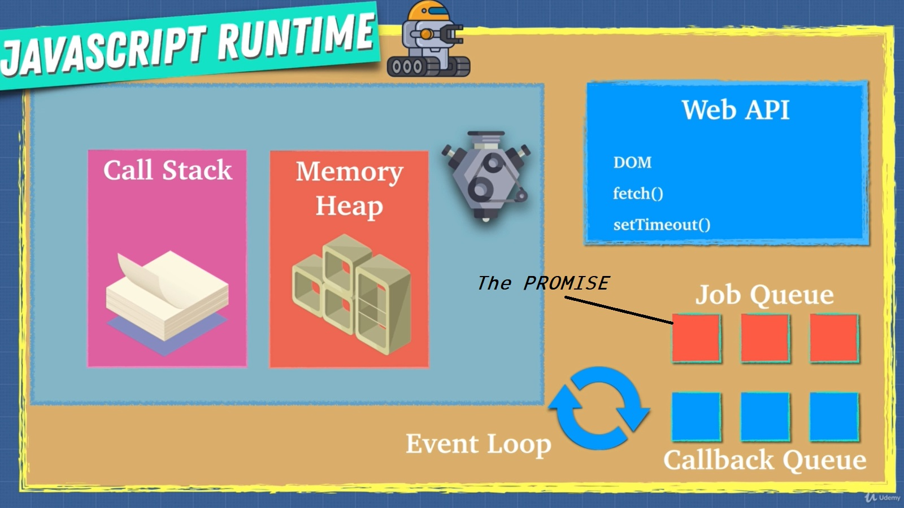

#### April 06, 2019
##### Day 1
*Logical Operators* using this method

```JavaScript
 var a = 100;
 console.log(a &gt; 70 ? 'yes' : 'no');
 output:
 yes
 
 // try to paste on console to see and try to experiment on it
 you can use it for variables something like this
 
 var grade = 60;
 var isFail = grade &lt; 75 ? 'fail' : 'Passed';
 console.log(isFail);
 output:
 fail
```

<p>Another ideas</p>
```JavaScript
 console.log(true &amp;&amp; false);
 output
 false
 console.log(true &amp;&amp; true);
 output
 true
 console.log(true || true);
 output
 true
 console.log(true || false);
 output
 true
 
 // you can use this as functions that returns a boolean type
 to help shorten your code
```

<p>Other ways to console a value</p>

```JavaScript
var name = 'vindecode';
 var age = 22;
 console.log('Hi im %s and I am %s year\'s old', name, age);
 output:
 Hi im vindecode and I am 22 year's old
 ```

<p>Small letters is always greater than Capital letters and all letters are greater than special characters</p>

```JavaScript
 console.log('a' &gt; 'A');
 output:
 true
 console.log('a' &lt; 'A');
 output:
 false
 console.log('a' &gt; '@' &amp;&amp; 'A' &gt; '@');
 output:
 true
 console.log('a' &lt; '@' &amp;&amp; 'A' &lt; '@');
 output:
 false
```

<p>The undefined and the null are equal</p>

```JavaScript
 console.log(null == undefined);
 output:
 true
```

<p>Zero and false are also equal</p>

```JavaScript
 console.log(0 == false);
 output:
 true
 // so you can use 1 or 0 as your true or false comparison
```

</div>
<div>
<div>April 07, 2019
<h6>Day 2</h6>
</div>
<p><strong>While loops</strong> is a loop that will always execute untill the condition is not true</p>

```JavaScript
 let result = 1;
 let counter = 0;
 while (counter &lt; 10) {
 result = result * 2;
 counter = counter + 1;
 }
 console.log(result);
 output:
 1024
 // No explanation just a syntax
```

<p><strong>Do While loops</strong> is a loop that execute first before doing the condition</p>

```JavaScript
 let sayYes;
 do {
 sayYes = prompt("Please say yes or else i will ask again");
 }
 while (sayYes.toLowerCase() != "yes");
 console.log(sayYes);
 output:
 yes
 // I use .toLowerCase() method to allow key sensitivity
```

<p><strong>For loop</strong> with break;</p>

```JavaScript
 for (let current = 20; ; current = current + 1) {
 if (current % 7 == 0) {
 console.log(current);
 break;
 }
 }
 output:
 21
 // We can use this style for infinite loops (looks like while loops never stop until it true the condition)
```

<p>shortcuts for adding, subtracting, multiply, device by itself</p>

```JavaScript
 a+=1;
 a-=1;
 a*=2;
 a/=5;
 a++;// multiply and devide will not work on this
 a--;// multiply and devide will not work on this
```

<p><strong>Switch syntax</strong></p>

```JavaScript
 switch (prompt("What is the weather like?")) {
 case "rainy":
 console.log("Remember to bring an umbrella.");
 break; case "sunny":
 console.log("Dress lightly.");
 case "cloudy": console.log("Go outside.");
 break;
 default:
 console.log("Unknown weather type!");
 break;
 }
```

</div>
<div>
<div>April 09, 2019
<h6>Day 3</h6>
</div>
<p><strong>Regular Expression</strong></p>
<p>You can get each letter of a string by doing this</p>

```JavaScript
 var name = "John Doe";
 name[1];
 output:
 o
 // you can use loop to get each of the letters
```

<p><strong>Functions</strong> You can pass a function to a variable</p>

```JavaScript
 var addNumbers = function(n1 ,n2) {
 console.log(n1 + n2) ;
 }
 addNumbers(5,10);
 output:
 15
 
 // Its just semilar with
 // function addNumbers(n1,n2){
 // console.log(n1 + n2);
 // }
 // RIGHT?!!!
 // You can also do this
 function addNum(n1,n2){
 console.log(n1 + n2);
 }
 var x = addNum;
 x(10,10);
 output:
 20
```

</div>
<div>
<div>April 12, 2019
<h6>Day 4</h6>
</div>
<p><strong>Regular Expression Continued</strong></p>
<p>Checking a string if it contains specific words using the test method</p>
<pre> var matches = /decode/;
 var yourText = "His name is Vindecode";
 var result = matches.test(yourText); // test method only returns true or false
 console.log(result);
 output:
 true
 </pre>
<p>Other dynamic way is this:</p>
<pre> var matches = "vindecode";
 var somethingMatches = new RegExp(matches); // creates a new instance of RegExp
 var yourText = "he is vinddd";
 var result = somethingMatches.test(yourText);
 console.log(result);
 output:
 false
 var yourText2 = "he is vindecode";
 var result2 = somethingMatches.test(yourText2);
 console.log(result2);
 output:
 true
 </pre>
<p>For keys insensitive you just need to add i</p>
<pre> var matches = /decode/;
 var yourText = "His name is VinDECODE";
 var result = matches.test(yourText);
 console.log(result);
 output:
 false
 var matchesInsensitive = /decode/i; // this is the syntax for key insensitive
 var yourText = "His name is VinDECODE";
 var result = matchesInsensitive.test(yourText);
 console.log(result);
 output:
 true
 // Using RegExp
 var matchesInsensitive = new RegExp("decode", "i"); // first param is the word you want to match the second is the i for insetivity
 var yourText = "His name is VinDECODE";
 var result = matchesInsensitive.test(yourText);
 console.log(result);
 output:
 true
 </pre>
</div>
<div>
<div>April 20, 2019
<h6>Day 5</h6>
</div>
<p><strong>Javascript Engine</strong> is a program used to translate javascript into machine code</p>
<p>each browser has its own javascript engine.</p>
<p>Chrome has <strong>V8</strong> which is created by google</p>
<p>Firefox has a <strong>spidermonkey</strong> which is created by the creator of the javascript</p>
<p><strong>ECMAScript</strong> is the one who Govern javascript engines so that, if someone creates an engine ECMAScript gives us the standard on how javascript works on each engine they created</p>
<p><strong>V8</strong> was created by google because they want their google maps, and other application runs faster as a top 1 search engine.</p>
<p>And now <strong>V8</strong> was now a common javascript engine used, specialy to their chrome browser</p>
<br /><br /><br />
<p>How <strong>Javascript</strong> was executed ?</p>
<p>By the use of javascript engines, a javascript file will be read by the use of Compiler or Interpreter so that it will be understand by a machine language</p>
<br /><br /><br />
<p><strong>Compiler</strong> vs <strong>Interpreter</strong> ?</p>
<p><strong>Interpreter</strong> reads the code line by line and gives the instruction to the cpu.</p>
<p><strong>Compiler</strong> converts the code into another code that the machine can understand</p>
<p><strong>Interpreter</strong> is fast because it will not consume time to convert the code and sends directly to the cpu.</p>
<p><strong>Compiler</strong> is also fast because it enhanced the code into a better one</p>
<pre>// if using a compiler this code will be simplified
 // JS CODE
 function sum(){
 for (var i = 0; i &lt; 10; i ++){
 return 5+10;
 }
 }
 // compiler will simplified this code as its just doing the same thing
 // Compiler
 function(){
 return 15;
 }
 // this is how compiler works
 </pre>
<p><strong>Google</strong> decides to combine them and that is <strong>v8</strong> engine and the name of the compiler inside the <strong>v8</strong> is <strong>JIT Compiler</strong> or <strong>Just In Time Compiler</strong></p>
<p>How <strong>v8</strong> works: first it reads the code line by line which is the job of an <strong>interpreter</strong> and their is a <strong>profiler</strong> that checks if their are repeating codes, if their is then it will be passed to a <strong>compiler</strong>.</p>
<br /><br /><br />
<p><strong>Call Stack</strong> and <strong>Memory Heap</strong></p>
<p><strong>Call Stack</strong> is the memory of each function or variables will be stored its logic is First In Last Out (FILO)</p>
<p>Example</p>
<pre> function a(num){
 return num * num;
 }
 function b(num){
 // debugger; we add this code so that we can set breakpoint to developer tools
 return a(num) + 2;
 }
 b(5);
 output:
 27
 // uncomment the debugger and go to mozilla or chrome debuger.
 </pre>
<p>You will see a <strong>Call Stack </strong>at the right pane and you can see the the function b was taken</p>
<p>and pressing the next step or step in for firefox you can see that each line was read and when it reads the function a we can see the a is added at the call stack but after it runs to that function it will be removed at the call stack, remember the FILO just play with it to understand more.</p>
<p><strong>Stack Overflow</strong> when calling a function by it self it will run out of memory because calling it self will loop and cause damage</p>
<pre> function a(){
 return a();
 }
 </pre>
<p><strong>Memory Heap</strong> is the memory of each values will be stored</p>
<p><strong>Memory Leak</strong> this will happen when cpu dont have space to put other values example</p>
<pre> var a = [];
 for (i = 10; i &gt; 1; i++){
 a[i] = i;
 }
 </pre>
<p>To avoid memory leaks</p>
<ul>
<li>Avoid Global variables</li>
<li>Adding EventListener because your decalring variable to an element and decalring EventListener again:
<pre> var element = document.getElementById('element');
 element.addEventListener('click', myfunction);
 </pre>
</li>
<li>using setInterval function must be stop if not using</li>
</ul>
<p>Remember that memory is limited so always be aware about <strong>Call Stack </strong> and <strong>Memory Heap</strong></p>
</div>
<div>
<div>April 21, 2019
<h6>Day 6</h6>
</div>
<p><strong>Javascript</strong> is a <strong>Single Threaded</strong> which means javascript runs a task once at a time</p>
<p>So dont think <strong>Javascript is shit!.</strong>. Let me explain something more about <strong>Javascript</strong>.</p>
<p>But first I want to prove it first that <strong>javascript</strong> is a single threaded language by doing this:</p>
<pre>// create html document with only just a button with a height of 200vh unit
 // and add a javascript below with alert('any text'); or just run a javascript on a console of that page with alert
 //try to run but dont even try to press ok on alert and try to click the button on your html or try to scroll down.
 // you'll see that button couldnt be clicked nor scroll because as what i said javascript cant run multiple task unless the first task is done then before going to other task.
 </pre>
<p>So dont think <strong>javascript</strong> is shit!...because there is a <strong>Javascript Runtime</strong> which the browser's offer to us</p>
<p>Javascript is synchronous becuase it runs one at a time.</p>
<br /><br /><br />
<p><strong>Javascript Runtime</strong> is a built on browser that runs on a background while javascript is executing something</p>
<p><strong>Javascript Runtime</strong> has also a WEB API, which comes from all browser (Chrome, Firefox, Opera, etc...)</p>
<p>Example of WEB API are:</p>
<ul>
<li>DOM</li>
<li>fetch() for getting http request</li>
<li>setTimeOut()</li>
<li>setInterval()</li>
</ul>
<p>so these are the WEB API which the <strong>Javascript Runtime gives us.</strong></p>
<p>For more API try to go to console and type <strong>window</strong> all of them are WEB API</p>
<p><strong>WEB API</strong> are asynchronous it runs a task at the background while javascript is running</p>
<p><strong>Remember</strong> this that all WEB API is not a javascript it is written in c++ which we can get from the browser to help javascript run without waiting for the other task</p>
<p>If javascript found a function <strong>setTimeOut()</strong> javascript will pass it to the WEB API to process it and javascript continue to run what is really for him. when javascript finished running all the task, WEB API will tell to javascript engine if they can now pass the result that which he did.</p>
<p>Other explanation, javascript will check all the codes and if their is a WEB API then it will passed to WEB API and WEB API will process it, even though WEB API finished processing it, it will still wait to the javascript if it was finished all of its task before javascript reads the WEB API task.</p>
<p>Common Interview about javascript is that they will ask you a question with a code something like this</p>
<pre> console.log('1');
 setTimeout(() =&gt; {console.log('2'),1000}); //this is a WEB API
 console.log('3');
 output:
 1
 3
 2
 </pre>
<p>As you can see javascript runs first everything before it runs the WEB API</p>
<p>Even though WEB API finished first it will wait to the <strong>Stack Que</strong> and <strong>Event loop</strong> will be the one to ask to the javascript engine if javascript is already done running and pass the what ever on the Stack Que.</p>
<p><strong>Node.js</strong> vs <strong>Javascript Runtime</strong> both of them are runtime but only difference is that node.js can run without a browser, while Javascript Runtime cant run without a browser</p>
<p><strong>Conclusions</strong></p>
<p><strong>JavaScript</strong> is like a musical notes or the codes</p>
<p><strong>Javascript Engine</strong> is the musician or composer that can read/understand the notes</p>
<p><strong>Javascript Runtime</strong> is the whole package it can create a note and can read the notes</p>
<br /><br /><br />
<p>Each function that is called on javascript is what they called as <strong>Execution Context</strong>.</p>
<p>Before adding an Execution Context or your function to the <strong>Call Stack</strong> we have a <strong>global() Execution Context</strong> which we can't see on the <strong>Call Stack</strong> but its in there we cant just see it. that global is created by the <strong>javascript engine</strong></p>
<p>The <strong>Global Execution Context </strong>will create a 2 things which is <strong>Global Object </strong>and the <strong>this</strong> keyword</p>
<p><strong>Global Object</strong> is <u>window</u> try to type on console, window</p>
</div>
<div>
<div>April 27, 2019
<h6>Day 7</h6>
</div>
<p><strong>Execution Context</strong> is a name of a function that will be added on the Call Stack</p>
<p>When we run a function the <strong>Javascript Engine</strong> will create an <strong>Execution Context</strong> and add it to the <strong>Call Stack.</strong></p>
<p>The <strong>Global Execution Context</strong> is the first or something like a wrapper or the parent of the functions that you have created</p>
<p>After all the functions done executing the <strong>Global Execution Context</strong> will be the last will be pop off to the <strong>Call Stack</strong></p>
<p>Remember that the very first thing inside a <strong>Call Stack</strong> is the <strong>Global Execution Context</strong></p>
<br /><br /><br />
<p><strong>Lexical Environment</strong> is about where does the function was executed.</p>
<pre>// Example
 function a(){ // this is lexical to global execution context
 return 'planet A';
 }
 function b() { // this is lexical to global execution context
 function c(){ // this is lexical to b execution context
 return 'planet B';
 }
 }
 // did you get what i mean ? lexical is about where the code was executed.
 </pre>
<p>Remember that Lexical is about where to code was written, while scope is who can access the variable</p>
<p>Once the javascript runs it creates an execution context which is the global execution context</p>
<p>Everytime we run a function it creates an execution context which will be added to our call stack, and the call stack will help us find the lexical of each codes.</p>
<br /><br /><br />
<p>When a javascript runs there is a <strong>Creation Phase</strong> and an <strong>Execution Phase</strong></p>
<p>In which during the <strong>Create Phase</strong> there is the creation of the <strong>Global Execution Context</strong> and the <strong>This</strong> object. after the creation of this two objects, their is also a <strong>Hoisting</strong></p>
<p>Remember when I say environment it is the execution context/function</p>
<p><strong>Hoisting</strong>is assigning all the variables or functions to undefined during Creation Phase reason for this is to allocate memory to the CPU before it runs the program</p>
<p>It checks all the variables and functions that you have on your code and assigned it to undefined</p>
<pre> console.log(a);
 var a = 'abc';
 function b(){
 return 'ddd';
 }
 output:
 undefined
 // the code above will be hoisted on creation phase, below code will show you how hoisted happen
 var a = undefined // we can't see this but this will happen because of hoisting
 var b = undefine // this is the function that being hoisted
 // above are the hoisting process, remember about the creation phase it reads all the variables and function to be equal to undefined reason for memory allocation
 console.log(a); // doing this on other language will cause an error because of calling it before declaring a variable, but because of hoisting it will not cause an error
 var a = 'abc';
 function b(){
 return 'ddd';
 }
 output:
 undefined //this undefined is the value of a
 </pre>
<br /><br /><br />
<p>Remember this every execution context, hoisting will always happen inside the environment/function/execution context</p>
<p>To avoid hoisting use <strong>const and let</strong></p>
<p>But using let and const key word for declaring a variable may cause error if calling a variable before it was declared not same with var because var can be hoisted.</p>
<p>Main thing about <strong>hoisting</strong> is that it allocates memory to the cpu before javascript runs to make javascript ready.</p>
<br /><br /><br />
<p>Another idea found</p>
<pre>// this is a function expression
 var a = function(){
 return 'abc';
 }
 // Other ways for function expression
 var a = () =&gt; {
 return 'abc';
 }
 // this is a function declaration
 function a(){
 return 'abc';
 }
 // when you call a function its name is Invocation/Call/Execution
 </pre>
<pre>// other ways to return a value
 function person(person1, person2){
 return `${person1} : ${person2}`;
 }
 </pre>
<p>At the Global Execution Context we have the global and this objects while on the execution context/ function we created, during the creation phase there are two objects will be created which will be the <strong>this and arguments</strong></p>
<pre> function person(person1, person2){
 console.log(arguments);
 }
 output:
 Arguments {0: 'person1 value' , 1: 'person2 value'}
 // but never use this arguments it may cause trouble later because its not returning an array. but instead use this techniques below
 function person(person1, person2){
 console.log(Array.from(arguments))
 }
 output:
 Array [person1 , person2]
 // these are some other ways
 function person(...args){ // this is a spread operator you can change args what ever you want
 console.log(Array.from(arguments));
 return `He is ${args[0]} and He is ${args[1]}`;
 }
 output:
 Array [value 1, value2]
 He is value1 and He is value2
 // remember that when using a return with this ${} technique use this ` because it will not work on simple qoute
 </pre>
<pre>// Experiment about the spread operators
 function alphabet(...letters){
 var l = Array.from(letters);
 var n = l.length;
 for (var i = 0; i &lt; n; i++){
 console.log(`This is letter : ${l[i]}`);
 }
 }
 // Good thing about spread operators can add multiple arguments
 alphabet('a','b','c','d','e','f','g','h','i','j','k','l','m','n','o','p','q','r','s','t','u','v','w','x','y','z',);
 output:
 This is letter : a
 This is letter : b
 This is letter : c
 This is letter : d
 This is letter : e
 This is letter : f
 This is letter : g
 This is letter : h
 This is letter : i
 This is letter : j
 This is letter : k
 This is letter : l
 This is letter : m
 This is letter : n
 This is letter : o
 This is letter : p
 This is letter : q
 This is letter : r
 This is letter : s
 This is letter : t
 This is letter : u
 This is letter : v
 This is letter : w
 This is letter : x
 This is letter : y
 This is letter : z
 </pre>
<p>A function without a paramater will still have an arguments but it will be empty object</p>
<pre> function person(){
 console.log(arguments);
 }
 output:
 {}
 </pre>
<p><strong>Variable Environment</strong> each execution context/function has its own variable environment</p>
<p><strong>Scope Chain</strong> which you can access variables from parents</p>
<pre> function a(){
 var a = 'a'; a can access variable of the global execution context
 function b(){
 var b = 'b';  b can access variable of a
 function c(){
 var c = 'c'; // c can access variable of b and a
 }
 }
 }
 // this will be the chain global() -&gt; a() -&gt; b() -&gt; c()
 </pre>
<p>Another thing during the execution context we also have a <strong>lexical variables</strong> in which javascript will create a scope of each variable in which where will be the variables can be used/ or who can access variables</p>
<p>Another idea here</p>
<pre> function a() {
 height = 50;
 return height;
 }
 output:
 50
 // its working but to avoid this thing you can do this
 'use strict'
 function a() {
 height = 50;
 return height;
 }
 output:
 error
 </pre>
<p><strong>Function Scope VS Block Scope</strong> Function scope creates variable on its enviroment and all child functions can access it. while Block Scope Every time there is a {} every variable that is inside of it cannot be access from the outside of the {}.</p>
<p>Most of the programming language are Block Scope but javascript isn't</p>
<pre> if( 5 &lt; 10){ //this is already a block scope but javascript can still able to console the var number
 var number = 100;
 }
 console.log(number)
 output:
 100;
 </pre>
<p>To allow javascript Block Scoping we can use let and const declarations</p>
<pre> if(5 &lt; 10){
 const number = 100;
 }
 console.log(number);
 output:
 error
 if(5 &lt; 10){
 let number = 100;
 }
 console.log(number);
 output:
 error
 </pre>
<p>let and const are still in the memory but only the engine will keep not to use it if its already outside of the brackets</p>
<br /><br /><br />
<p>Remember the global variables are bad because it may cause memory leaks or variable colision or overides the value</p>
<p>To minimize global variables issue we have this modern technique <strong>IIFE (Imediately Invoke Function Expression)</strong></p>
<pre> (function(){ //we create a function expression not a declaration, then create anonymous<br /> function which has no name after the function we Invoke it directly by calling ()
 })();
 </pre>
<br /><br /><br />
<p><strong>This</strong> the this keyword definition is "This is the object that the function is a property of"</p>
<pre> var person = {
 name : 'Vincent',
 talent : 'Sing',
 sing : function() {
 return 'ohhh lalala ' + this.name // because we cannot access person.name <br /> we can try to call it by using this, this.name = person.name
 }
 }
 // some short ways just compare the codes
 var person = {
 name : 'Vincent',
 talent : 'Sing',
 sing() {
 return 'ohhh lalala ' + this.name // because we cannot access person.name <br /> we can try to call it by using this, this.name = person.name
 }
 }
 </pre>
</div>
<div>
<div>April 28, 2019
<h6>Day 8</h6>
</div>
<p><strong>The main pupose of <u>this</u></strong> is that it gives methods access to their object</p>
<p>The second purpose will be it execute same code for multiple objects</p>
<pre> var name = "vindecode" // default name and this is in the global execution context (we must use const here but its not working for this time i created this) <br />
 function winner() {
 return 'The winner is ' + this.name;
 }
 const obj1 = {
 name : 'vindecodex',
 winner : winner
 }
 const obj2 = {
 name : 'vincent',
 winner : winner
 }
 winner(); // remember to run this 1 by 1
 obj1.winner(); // remember to run this 1 by 1
 obj2.winner();// remember to run this 1 by 1
 // by this example you will get more understanding on how this works
 </pre>
<p>As you can see, we created one function but multiple objects can use that function, hope that you get what I mean</p>
<p>More idea, always think that <u>this</u> is a word "Who Called Me" because this is a placeholder depends on who called the this keyword.</p>
<br /><br /><br />
<p>Another idea here</p>
<pre> const a = {
 name : 'Vindecode',
 winner : function() {
 console.log('a' , this);
 var anotherFunc = function() {
 console.log('b' , this);
 }
 anotherFunc();
 }
 }
 a.winner()
 output:
 a Object { name : "Vindecode", winner : winner() }
 b Window // why its not returning the object of a ?
 //This is a common error and to solve this we use the arrow function on es6
 const a = {
 name: 'Vindecode',
 winner : function(){
 console.log('a', this);
 var anotherFunc = () =&gt; { // by using this it lexically bind this, it checks what objects soround this
 console.log('b' , this);
 }
 anotherFunc();
 }
 }
 a.winner()
 output:
 // b now is returning object of a
 a Object { name : "Vindecode", winner : winner() }
 b Object { name : "Vindecode", winner : winner() }
 //But before the es6 this is how it is solved
 const a = {
 name : 'Vindecode',
 winner : function() {
 console.log('a' , this);
 var anotherFunc = function() {
 console.log('b' , this);
 }
 return anotherFunc.bind(this);// the this here refers to the a object
 }
 }
 a.winner()() //we run the function two times
 output:
 a Object { name : "Vindecode", winner : winner() }
 b Object { name : "Vindecode", winner : winner() }
 // One more thing to solve this problem
 const a = {
 name: 'Vindecode',
 winner: function() {
 console.log('a' , this);
 var self = this; // we use this to referrence to this object a
 var anotherFunc = function() {
 console.log('b', self);
 }
 return anotherFunc()
 }
 }
 a.winner()
 output:
 a Object { name : "Vindecode", winner : winner() }
 b Object { name : "Vindecode", winner : winner() }
 </pre>
<p>I know its hard for me to explain how really <u>this</u> works, but its better to play with it because experience is the best part of learning, you will just understand its nature by always using it.</p>
<br /><br /><br />
<p><strong>The call(), apply() and bind()</strong></p>
<p>Call and Apply are just more likely similar but the only differences is that apply accepts array of parameter.</p>
<pre> const wizard = {
 name: 'Chen',
 health: 100,
 heal : function(){
 this.health = 100;
 }
 }
 const archer = {
 name: 'Trax',
 health: 30
 }
 // the goal here is that how can we borrow the heal function of the wizard object without copying the heal function to our code.
 // this is were the call() function works
 wizard.heal.call(archer); // the first parameter on call is the object archer
 archer;
 output:
 Object { name: "Trax", health: 100 } // as you can see archer health now is 100
 //if heal function has a parameter this is how it will be call()
 const wizard = {
 name: 'Chen',
 health: 100,
 heal : function(num1, num2){
 this.health += num1 + num2 ;
 }
 }
 const archer = {
 name: 'Trax',
 health: 30
 }
 wizard.heal.call(archer,50,30) //the first param is the object followed by the parameters of the function heal
 archer
 output:
 Object { name: "Trax", health: 110 }
 // now the apply accepts array of parameters this is how it looks like
 wizard.heal.apply(archer, [50, 30])
 archer
 output:
 Object { name: "Trax", health: 110 }
 </pre>
<p>Call and Apply are used for borrowing methods of an object</p>
<p>While bind is useful to call a function for later on use, because we are storing a function of another object to another variable.</p>
<pre> const wizard = {
 name: 'Chen',
 health: 100,
 heal : function(num1, num2){
 this.health += num1 + num2 ;
 }
 }
 const archer = {
 name: 'Trax',
 health: 30
 }
 const healArcher = wizard.heal.bind(archer, 10, 30);
 healArcher() //now we can call it, but we can call it for later use right ?
 archer
 output:
 Object { name: "Trax", health: 70 }
 </pre>
<p>Another tricks for using bind</p>
<pre> function multiply(a,b){
 return a*b;
 }
 // the goal here is to give a partial parameter to the multiply function
 let multiplyByTwo = multiply.bind(this, 2);
 let multiplyByTen = multiply.bind(this,10);
 console.log(multiplyByTwo(4));
 console.log(multiplyByTen(5));
 output:
 8
 50
 </pre>
<p>Context vs Scope</p>
<p>Scope is a function based, it is about what variable a function can access when it is invoked</p>
<p>Context is all about object based, context is what the value the this keyword which is that reference that object that owns that current execution code</p>
<p>Context can be determine of how a function invoked the value of this keyword</p>
<p>and scope refers to the visibility of variables</p>
</div>
<div>
<div>April 30, 2019
<h6>Day 9</h6>
</div>
<p><strong>Javascript Types</strong> has 7 of them</p>
<ul>
<li>Number</li>
<li>String</li>
<li>boolean</li>
<li>Undefined</li>
<li>null</li>
<li>symbol</li>
<li>Object</li>
</ul>
<p>undefined - is the absence of definition</p>
<p>null - is the absence of value</p>
<br />
<p><strong>Primitive and Non-Primitive</strong></p>
<p>Primitve type - has single value</p>
<p>Non-Primitive type - has more than 1 value (obj,function,array)</p>
<br /><br /><br />
<p>To check if it is an array</p>
<pre> var arr = [];
 var notArr = {};
 console.log(Array.isArray(arr));
 console.log(Array.isArray(notArr));
 output:
 true
 false
 </pre>
<p>Primitive type can pass by value</p>
<pre> var a = 5;
 var b= a;
 b++;
 console.log(a);
 console.log(b);
 output:
 5
 6
 </pre>
<p>while non-primitive type reference a value not passing a value</p>
<pre> const obj1 = { name : 'vindecode', pass : '123' };
 const obj2 = obj1;
 obj2.pass = 'easypeasy';
 console.log(obj1);
 console.log(obj2);
 output:
 Object { name: "vindecode", pass: "easypeasy" }
 Object { name: "vindecode", pass: "easypeasy" }
 // same with array
 const arr1 = [1,2,3];
 const arr2 = arr1
 arr2.push(123123123);
 console.log(arr2);
 console.log(arr1);
 output:
 Array(4) [ 1, 2, 3, 123123123 ]
 Array(4) [ 1, 2, 3, 123123123 ]
 // but what if, we really would like to copy a new array, we can simply do this.
 const arr1 = [1,2,3];
 const arr2 = [].concat(arr1);
 arr2.push(123123123);
 console.log(arr2);
 console.log(arr1);
 output:
 Array(4) [ 1, 2, 3, 123123123 ]
 Array(4) [ 1, 2, 3 ]
 //doing this on object it would be deferent code
 const obj1 = {a: 1, b: 2, c: 3};
 const cloned = Object.assign({}, obj1);
 obj1.c = 100;
 console.log(cloned);
 console.log(obj1);
 output:
 Object { a: 1, b: 2, c: 3 }
 Object { a: 1, b: 2, c: 100 }
 //other ways of doing it. using the spread operator its a new feature of javascript
 const obj1 = {a: 1, b: 2, c: 3};
 const cloned = {...obj1};
 obj1.c = 100;
 console.log(cloned);
 console.log(obj1);
 output:
 Object { a: 1, b: 2, c: 3 }
 Object { a: 1, b: 2, c: 100 }
 </pre>
<p>They both equal because obj or non premitive type pointing on same memory on which the object is, not same with primitive had deferent memory locations. so it means that non primitive types are referencing.</p>
<p>Good thing about referencing we save to much cost of memory because objects can hold a massive memory thats why it only reference a value not copying it.</p>
<p>What we did for now is <strong>shalow cloning</strong>, what it means the we only copy the first layer of an object what if we had an object within an object</p>
<pre> const obj1 = {a: 1, b: 2, c: 3, d : {messy : 'try to copy me!'}};
 const cloned = {...obj1};
 obj1.d.messy = "gotcha!...";
 console.log(cloned);
 console.log(obj1);
 output:
 a: 1
 b: 2
 ​c: 3
 ​d: Object { messy: "gotcha!..." }
 a: 1
 b: 2
 ​c: 3
 ​d: Object { messy: "gotcha!..." }
 // now were just referencing the second object we haven't copy it.
 </pre>
<br />
<p>Ways to <strong>deep clone</strong> an object is to do JSON</p>
<pre> const obj1 = {a: 1, b: 2, c: 3, d : {messy : 'try to copy me!'}};
 const cloned = JSON.parse(JSON.stringify(obj1));
 obj1.d.messy = "gotcha!...";
 console.log(cloned);
 console.log(obj1);
 output:
 a: 1
 b: 2
 ​c: 3
 ​d: Object { messy: "try to copy me!" }
 a: 1
 b: 2
 ​c: 3
 ​d: Object { messy: "gotcha!..." }
 //now we are copying all the objects inside an object, were not referencing it anymore.
 </pre>
<p>Remember that it may cause to slow down your program by cloning an object, specially if your object are massive data, it may took time to clone all of the data on an object if it is massive.</p>
<pre>//exercise
 // How would you compare two objects if they are pointing to a different location in memory but still have the same properties?
 var user1 = {name : "nerd", org: "dev"};
 var user2 = {name : "nerd", org: "dev"};
 var eq = user1 == user2;
 console.log(eq);
 output:
 false
 </pre>
<p>Other answer <a href="https://stackoverflow.com/questions/1068834/object-comparison-in-javascript" target="_blank" rel="noopener">stackoverflow</a></p>
<br /><br /><br />
<p><strong>Coercion</strong> is converting a type to different type. to make it equal.</p>
<pre> 1 == '1'
 // coercion happens on double equal
 output:
 true
 1 === '1'
 // friendly advice always use 3 equals ;)
 output:
 false
 </pre>
<a href="https://dorey.github.io/JavaScript-Equality-Table/" target="_blank" rel="noopener">Javascript Equality Table</a><a href="https://developer.mozilla.org/en-US/docs/Web/JavaScript/Equality_comparisons_and_sameness" target="_blank" rel="noopener">Equality comparisons and sameness</a><br /><br />
<p><strong>Static VS Dynamic Typing</strong></p>
<p>Static</p>
<ul>
<li>C#</li>
<li>C</li>
<li>C++</li>
<li>Java</li>
</ul>
<p>Dynamic</p>
<ul>
<li>PHP</li>
<li>Javascript</li>
<li>Python</li>
<li>Ruby</li>
</ul>
<p>Any programming language that declares a type of variable first example int a = b; this type of language are static while dynamic same with javascript var a = b; it doesnt require to put a stype of variable, this is how a dynamic works.</p>
<p>The good thing about static is that less bugs because we can actually catch all the error before it runs.</p>
<p><strong>Typescript</strong> so we have this to make our javascript static, to have less bugs</p>
<p><strong>Strong and Weak Typing</strong></p>
<p>Javascript is a weak typing. but typescript can make our javascript strong</p>
<pre> var a = 'blablabla'
 a + 123;
 output:
 "blablabla123"
 // this is how weak means its doing a coercion
 // in strong typed language you can't do this
 </pre>
<br /><br /><br />
<p>Just a review about the function()</p>
<p>When we invoke a function we already had a two parameters which is <strong>this </strong>and <strong>arguments.</strong></p>
<p>When all know the arguments are like array of objects that has some weird behaviors for looping and etirations, so we wanna have avoid this, instead we gonna use some spread operators</p>
<br /><br /><br />
<p>Ways on invoking a function</p>
<pre> function a(){
 return 5;
 }
 a();
 const obj = {
 one : function () {
 return 1;
 }
 }
 obj.one;
 function a(){
 return 5;
 }
 a.call();
 // other ways you might not see this before
 // this one called a FUNCTION CONSTRACTOR
 const four = new Function('return 4');
 four();
 output:
 4
 // we can also add a parameter
 const four = new Function('num','return num');
 four(4);
 output:
 4
 </pre>
<p>Remember that functions are objects a special objects or a callable objects</p>
<pre>//this is the inside of a function
 /*
 somefunction(){
 code() - that we are going to execute when we call/invoke it
 Name(optional) - name of our function, it is optional because we can create anonymous function
 Properties { - remember this from the last pages
 .call()
 .apply()
 .bind()
 }
 } */
 
 </pre>
<p>Other Ideas</p>
<pre>// functions can be pass to a variable
 var a = function(){};
 // function can be a parameter of a function and run it within a function
 function a(fn){
 fn();
 }
 a(function(){console.log('lallalalala')});
 // we can return a function as a value of other function
 function a(){
 return function b(){console.log('w0w');}
 }
 a()();
 output:
 w0w
 // or assign it to a variable
 var c = a();
 c();
 output:
 w0w
 </pre>
<p>Because of this they called Javascript as <strong>First Class Citizens</strong></p>
<p>Another idea</p>
<pre>// we can put default parameter value to a function to avoid undefined
 function a(param = 10){
 return param;
 }
 a()
 output:
 10
 // this is a new feature for es6
 </pre>
</div>
<div>
<div>May 1, 2019
<h6>Day 10</h6>
</div>
<p><strong>Higher Order Function (HOF)</strong> are simply a function that can take a function as an argument or a function that returns another function.</p>
<p>But most people only understand what HOF does but didn't understand how useful is HOF is!.</p>
<p>Remember to create a generic functions so that it can be used by many,keep code dry,use HOF</p>
<br /><br /><br /><strong>2 Pillars</strong>
<p><strong>Closures and Prototypes</strong></p>
<p>Closures is all about storing data if someone is still referencing on it even though the main function already pop out to the call stack it will be stored to the closure.</p>
<p>Closure is a combination of Lexical Scope and a function, closure will just happen if a function has an access of that variable. or its scope chain is available to that function.</p>
<pre> function a(){
 debugger; // to pause the program at this line
 let grandpa = "grandpa"
 return function b(){ //before running this function a() will be pop out to the call stack
 let father = "father"
 return function c(){ //before running this function b() will be pop out to the call stack
 let son = "son"
 return `${grandpa} &gt; ${father} &gt; ${son}` //because of referencing the datas of function a() and b() , the datas will be stored on closures even though function a() and b() were already pop out to the stack.
 }
 }
 }
 a()()();
 // on the debugger just press step in to run the code line by line.
 output:
 "grandpa &gt; father &gt; son"
 </pre>
<p><strong>2 Main benefits of Closures</strong></p>
<ul>
<li>Memory Efficient</li>
<li>Encapsulation</li>
</ul>
<pre>//it is memory efficient because of these
 function heavyDuty(index){
 const arr = new Array(7000).fill('V');
 console.log('created');
 return arr[index];
 }
 heavyDuty(600)
 heavyDuty(500)
 heavyDuty(1000)
 output:
 // it was repeating, but with closure we can do it once
 created
 created
 created
 "V"
 //doing it with closure
 function heavyDuty2(){
 const arr = new Array(7000).fill('V');
 console.log('Created Again');
 return function(index){
 return arr[index] // were creating closure here because we reference arr from heavyDuty2 array
 }
 }
 const getHeavyDuty = heavyDuty2(); // Again were referencing the function so were creating a closure with these
 getHeavyDuty(800)
 getHeavyDuty(500)
 getHeavyDuty(400)
 output:
 Created Again // now we do it once
 "V"
 </pre>
<p>Another Idea about closure and it is commonly interviewed problem</p>
<pre>//here is the problem
 const array = [1,2,3,4]
 for(var i=0; i &lt; array.length; i++){
 setTimeout(function(){console.log('Im at index ' + [i])}, 4000);
 }
 output:
 Im at index 4
 Im at index 4
 Im at index 4
 Im at index 4
 // this is not what we want to appear.
 // solution 1
 const array = [1,2,3,4]
 for(let i=0; i &lt; array.length; i++){ //changing var to let because let is block scope.
 setTimeout(function(){console.log('Im at index ' + [i])}, 4000);
 }
 output:
 Im at index 0
 Im at index 1
 Im at index 2
 Im at index 3
 //solution 2 without using the let, we will use IIFE
 // were also doing closure here
 const array = [1,2,3,4]
 for(let i=0; i &lt; array.length; i++){ //changing var to let because let is block scope.
 (function(indexI){
 setTimeout(function(){console.log('Im at index ' + [indexI])}, 4000);
 })(i);
 }
 output:
 Im at index 0
 Im at index 1
 Im at index 2
 Im at index 3
 </pre>
</div>
<div>
<div>May 04, 2019
<h6>Day 11</h6>
</div>
<p><strong>Prototypal Inheritance</strong>, remember that arrays and functions are objects in javascript</p>
<figure></figure>
<p>The object there is the base object.</p>
<p>If we create an array or function when we add this __proto__ we can access the base object.</p>
<pre>// Example
 const array = [];
 array.__proto__
 output:
 // it will return an array, but if we do it two times
 array.__proto__.__proto__
 output:
 //it now returns an object which is the base object
 </pre>
<p>Now lets try prototypal inheritance</p>
<pre> let dragon = {
 name: "Alacad",
 fire: true,
 fight(){
 return 5
 },
 sing(){
 if(this.fire){
 return `This is ${this.name} singing the dragon fire`
 }
 }
 }
 let lizard = {
 name: "Kiki",
 fight(){
 return 1
 }
 }
 // we want to inherit the property of dragon which is fire and sing to our lizard how can we do that ?
 lizard.__proto__ = dragon;
 lizard.sing()
 lizard.fire
 output:
 "This is Kiki singing the dragon fire"
 true
 // now lizard has the property of sing() and fire which he inherit from the dragon
 </pre>
<p>Reminder that never ever use this __proto__ it affects the performance, but we have other ways of doing it later on Object Oriented Programming</p>
<br /><br />
<p>Good thing about inheretance is that it saves a lot of memory, because imagine what if we had a lot of lizard then its really too bad to copy those properties all over, so that is how very important is inheritance is. Were being efficient with our code</p>
<p>Remember that __proto__ is just a pointer to what ever its base or something like in directory a cd .. your pointing back to your what ever previous.</p>
<figure></figure>
<br /><br />
<p>The base ARRAY and FUNCTION has their own properties that their child functions or arrays can access.</p>
<p>Example the Base FUNCTION has:</p>
<ul>
<li>call()</li>
<li>apply()</li>
<li>bind()</li>
</ul>
<p>The reason why we can still access that properties its because functions that we created is inherting the parent which is the base FUNCTION</p>
<pre>// just another idea on loop
 const array = [1,2,3,4,5,6]
 for(let i in array){
 console.log('this is the items of the array', array[i]);
 }
 output:
 this is the items of the array 1
 this is the items of the array 2
 this is the items of the array 3
 this is the items of the array 4
 this is the items of the array 5
 this is the items of the array 6
 </pre>
<br /><br />
<p>As i have mentioned were going to inherit an object without using that evil __proto__</p>
<pre> const human = {
 mortal: true
 }
 const einstien = Object.create(human) // einstien is still a human so we are goin to inherit human
 einstien.mortal
 output:
 true
 </pre>
<p>Remember that only functions has a prototype property</p>
<p>Adding a function to the Date which is already on javascript, how can we add a function their ?</p>
<pre> Date.prototype.lastYear = function(){
 return this.getFullYear() - 1;
 }
 new Date('1990-10-10').lastYear();
 output:
 1989
 </pre>
<pre>//modify .map to print "V" at the end of each item
 Array.prototype.map = function(){
 let arr = [];
 for (let i =0; i &lt; this.length; i++){
 arr.push((this[i] + "V"));
 }
 return arr;
 }
 console.log([1,2,3].map());
 output:
 Array(3) [ "1V", "2V", "3V" ]
 </pre>
<p>But avoid modefying existed functions on the javascript it may cause trouble to other codes that uses it.</p>
<p><strong>Starting OOP</strong></p>
<p>From Procedural to Cleaner Code using OOP</p>
<p><strong>Factory Function</strong> is a function that creates object</p>
<pre>// step 1 of OOP without factory functions
 //Create two elfs
 const elf = {
 name: 'peter',
 weapon: 'bow',
 attack(){
 return 'Attack with ' + elf.weapon
 }
 }
 const elf2 = {
 name: 'peter',
 weapon: 'bow',
 attack(){
 return 'Attack with ' + elf.weapon
 }
 }
 elf.attack();
 elf2.attack();
 //step 2 with factory function
 function createElf(name,weapon){
 return {
 name,
 weapon,
 attack(){
 return 'Attack with ' + weapon
 }
 }
 }
 const peter = createElf('peter', 'stones');
 peter.attack();
 const molly = createElf('molly', 'gun');
 molly.attack();
 //so we avoided lots of code, but their is still a problem here
 //what if we require 1000 elfs here, so we require a lot of space to store data
 //each time we create elfs we store attack() function on each of them so we need to apply closures and prototype next
 </pre>
<p><strong>Object.create</strong></p>
<pre> const elfFunctions = {
 attack(){
 return 'Attack with ' + this.weapon
 }
 }
 function createElf(name,weapon){
 let newElf = Object.create(elfFunctions) //were creating prototypal inheritance hereuuuuuuuuuuu
 newElf.name = name;
 newElf.weapon = weapon;
 return newElf;
 }
 const peter = createElf('peter', 'stones');
 console.log(peter.attack());
 const molly = createElf('molly', 'gun');
 console.log(molly.attack());
 </pre>
<p><strong>Constructor Function</strong></p>
<pre> function Elf(name,weapon){
 this.name = name;
 this.weapon = weapon;
 }
 Elf.prototype.attack = function(){
 return 'Attack with ' + this.weapon
 }
 const peter = new Elf('peter', 'stones'); // to enable use the this key word we need to use new by calling the function
 console.log(peter.attack());
 const molly = new Elf('molly', 'storm')
 console.log(molly.attack());
 output:
 "Attack with stones"
 "Attack with storm"
 // remember that constructor function must have a new keyword, the built in constructor function in javascript are starts with capital letter
 When creating a constructor function use capital letter on first letter to let know other developer that it is a constructor and they were goin to use the new keyword
 // ex. Function(),Number(),Array()..etc
 </pre>
<p>By using constructor functions we can also create another function that all elfs that we created can use</p>
<pre>// another idea here.
 function Elf(name,weapon){
 this.name = name;
 this.weapon = weapon;
 var a = 10; //it will not allow us to console the value of a because only data we can get is that everything that has a this keyword
 console.log(a);
 }
 const peter = new Elf('peter','stones');
 peter
 output:
 Object { name: "peter", weapon: "stones" }
 </pre>
<p>Because of the keyword new and we all know that new is defined as constructor function, new also creates prototype thats why we are able to create a Elf.prototype.attack but always remember that all functions has a prototype, yah its confusing but just code and code you'll just understand why.</p>
<figure></figure>
</div>
<div>
<div>May 5, 2019
<h6>Day 12</h6>
</div>
<p><strong>ES6 Classes</strong></p>
<pre>// comment here
 class Elf{
 constructor(name,weapon){
 this.name = name;
 this.weapon = weapon;
 }
 attack(){
 return 'Attack with ' + this.weapon;
 }
 sing(){
 return this.name + ' sings lalala'
 }
 }
 const peter = new Elf('peter','stones')
 console.log(peter.attack())
 console.log(peter.sing())
 </pre>
<p>Common interview question, why we are not putting the attack function to the constructor ?.</p>
<p>Its because constructor runs everytime we create an instance, name and weapon are unique but the attack is shares by all the elfs and it will cost a lot of memory if we want it to run everytime we instanciate.</p>
<p>instanciate is when we call a new Elf in our code that is instanciate, peter instanciate with elf class</p>
<hr />
<p><strong>Object.create vs Classes</strong></p>
<p>What we did on classes can also be created on Object.create, although Object.create was the most pure thing, but it depends uppon the company eigther they will use Object.create or with classes.</p>
<hr />
<p><strong>4 ways on manipulating the this key word</strong></p>
<pre>//new binding this
 function Person(name,age){
 this.name = name;
 this.age = age;
 }
 const person1 = new Person('Peter', 55);
 person1
 //person1 is now an object because of constructor we instanciate and because it is now an object the this keyword that we used <br /> on function Person will directly point to the person1 object thats why we get it right and not undefined.</pre>
<hr />
<pre> //implicit binding
 const person = {
 name: 'vindecode',
 age: 55,
 hi(){
 return 'hi this is ' + this.name
 }
 }
 person.hi();
 //it directly call its own object</pre>
<hr />
<pre> //explicit binding
 const person = {
 name: 'vindecode',
 age: 55,
 hi : function(){
 console.log('hi' + this.setTimeout)
 }.bind(window)
 }
 person.hi();
 //we wanted to point this to window because we all know that setTimeout is a web API and can be seen on the window object. so we bind it to the window object using the bind()
 //this explicit ways can also use the call and apply method</pre>
<hr />
<pre>//arrow functions
 const person = {
 name: 'vindecode',
 age: 55,
 hi : function() {
 var inner = () =&gt; {
 return this.name;
 }
 return inner()
 }
 }
 person.hi();
 //becuase of arrow function we allow it to point where it was called, it acts like implicit because we call it on function hi
 //without arrow function that this will point to window object
 </pre>
<hr />
<p><strong>Inheritance</strong></p>
<pre> class Character{ //this is a super class
 constructor(name,weapon){
 this.name = name;
 this.weapon = weapon;
 }
 }
 class Elf extends Character { //this is a sub class
 constructor(name,weapon,type){
 super(name,weapon); //we really need to call the super class which is Charater to able to use the this keyword
 this.type = type;
 }
 }
 class Ogre extends Character {
 constructor(name,weapon,color){
 super(name,weapon);
 this.color = color;
 }
 buildHouse() {
 return 'Building the biggest house'
 }
 }
 const peter = new Elf('Peter','Stones', 'Elf');
 console.log(peter);
 const shrek = new Ogre('Shrek', 'Puddle', 'Green');
 console.log(shrek);
 console.log(shrek.buildHouse());
 //As you can see super or the Parent class here represents the general needs of the sub classes.
 // extends is linking not copying
 </pre>
<hr />
<p><strong>public and private</strong> is still under construction</p>
<hr />
<p><strong>4 pilars of OOP</strong></p>
<ul>
<li><strong>Encapsulation </strong> - creating boxes or parts of each functions or grouping them</li>
<li><strong>Abstraction </strong> - giving data to a function and allow them to run at the background and gives you the output</li>
<li><strong>Inheritance </strong> - extending or linking one function to other function to allow dry code or to avoid copy and pasting similar codes.</li>
<li><strong>Polymorphism </strong> - calling similar code but produces different outputs</li>
</ul>
<br /><hr />
<p><strong>Functional Programming</strong> is all about separation of conerns which object oriented programming does as well right ?. its all about separating our codes into different chunks so that everything is well organize, but OOP separates codes buy object or by parts while functional separates functions and data's</p>
<p>Important pillar of the functional programming is <strong>Pure Functions</strong> it separates the data of a program and the behavior of a program</p>
<p>What are <strong>Pure Functions ?</strong> when it comes to pure functions theirs two main things a function has to always return the same output given the same input and the function cannot modify anything outside of it self no side effects</p>
<p>Pure Functions:</p>
<ul>
<li>No side effects</li>
<li>input --&gt; output same</li>
</ul>
<pre>//side effects is a function that modifies anything outside of it self
 const array = [1,2,3]
 function a(arr){
 arr.pop()
 }
 a(array);
 console.log(array);
 output:
 Array [ 1, 2 ] //this is called side effects because we modify data from the outside of a function
 //no side effects
 const array = [1,2,3]
 function a(arr){
 const newArray = [].concat(arr) //now we copy array instead of referencing it so that we can avoid side effects <br /> to its global variable which is from the outside of this function
 newArray.pop()
 return newArray
 }
 console.log(a(array)); //function
 console.log(array); //original no side effects
 output:
 Array [ 1, 2 ] // function
 Array(3) [ 1, 2, 3 ] // original variable array</pre>
<hr />
<pre> //another no side effects
 const array = [1,2,3]
 function multiplyByTen(arr){
 return arr.map(item =&gt; item * 10)
 }
 console.log(multiplyByTen(array))
 console.log(array)
 output:
 Array(3) [ 10, 20, 30 ] // function
 Array(3) [ 1, 2, 3 ] // original variable array it has no side effect
 </pre>
<p><strong>Referential Transparency</strong></p>
<pre> function a(num1,num2){
 return num1 + num2
 }
 function b(num){
 return num*2
 }
 b(a(3,4)); //this is equal to 7
 b(7) // referential transparency means if we change this to 7 it will produce same output as b(a(3,4))
 output:
 14
 14
 //and both of this are not having any side affects to the outside world because they only modifying their parameters <br />and parameters are local variables
 //the idea also of input --&gt; output is that even how many times we run the function the output will always be the same nothing will change.
 </pre>
<pre>//another idea on loop
 const array = ["A","B","C","D"];
 function myArray(arr){
 arr.forEach(item =&gt; {
 console.log(item)
 })
 }
 myArray(array);
 output:
 A
 B
 C
 D
 </pre>
<pre>//another idea about array
 function greaterThanTen(array){
 return array.map(item =&gt; item &gt; 10 ? true : false)
 }
 greaterThanTen([1,2,3,4,5,6,7,8,9,10,11])
 output:
 Array(11) [ false, false, false, false, false, false, false, false, false, false, true]
 </pre>
</div>
<div>
<div>May 06, 2019
<h6>Day 13</h6>
</div>
<p><strong>Idempotence</strong> is about having the same result no matter how many times we run the function</p>
<pre> function a(num){
 return num;
 }
 a(a(a(5)));
 output:
 5
 //another example
 Math.abs(Math.abs(Math.abs(-100)));
 output:
 100
 </pre>
<p>Get the idea about Idempotence ? no matter how many times we call the function the output would be the same</p>
<hr />
<p><strong>Imperative vs Declarative</strong></p>
<ul>
<li><strong>Imperative</strong> - is code that tells the machine on what to do and how to do. or a step by step guide to get the required task that you want it to do.</li>
<li><strong>Declarative</strong> - just a direct task no step by step instruction</li>
</ul>
<pre>// dont be confused by this
 for( let i= 0; i &lt; 1000; i++){ //this is Imperative
 console.log(i)
 }
 [1,2,3].forEach(item =&gt; console.log(item)); //this is declarative
 </pre>
<p>Declarative code is better, but we cannot avoid having Imperative code.</p>
<hr />
<p><strong>Immutability</strong> is about not changing everything or not changing the state, just copy it but do not change</p>
<pre> const obj = {
 name : "vince",
 clone() {
 return {... obj} //this is pure
 }
 }
 function updateName(obj){
 const updatedName = obj.clone(obj);
 updatedName.name = "Nana"
 return updatedName
 }
 output:
 Object { name: "vince", clone: clone() }
 Object { name: "Nana", clone: clone() }
 //now we are not changing everything nor its state but copying it.
 </pre>
<p><strong>Currying</strong> is taking a parameter of a function one at a time</p>
<pre> const multiply = (a) =&gt; (b) =&gt; a*b;
 const multiplyByTen = multiply(10);
 multiplyByTen(5);
 output:
 50
 </pre>
<p><strong>Partial Application</strong></p>
<pre> const multiply = (a,b,c) =&gt; a*b*c
 const multiplyByFive = multiply.bind(null,5); //null because we do not have this here but we gave argument 5 to parameter a
 multiplyByFive(10,4) //which is the b and c parameters
 output:
 200
 </pre>
<p><strong>Memoization</strong> is about remembering things that already been calculated so that it doesnt required time to calculate it again</p>
<pre> const cache = {}
 function addTo80(n){
 if(n in cache){
 return cache[n];
 }else{
 console.log('Calculating in a long time')
 cache[n] = n + 80;
 return cache[n]
 }
 }
 console.log(addTo80(5));
 console.log(addTo80(5));
 console.log(addTo80(5));
 console.log(addTo80(20));
 console.log(addTo80(30));
 output:
 Calculating in a long time
 85
 85
 85
 Calculating in a long time
 100
 Calculating in a long time
 110</pre>
<hr />
<pre> //optimizing our code using closures
 //moving the cache to the function, because we need to avoid global variables
 function addTo80(){ //we are transfering the param because we are now calling returned func
 const cache = {}
 //lets add another function to avoid cache to be reset to empty object
 //so that we will just need to call this function
 return function(n){
 if(n in cache){
 return cache[n]; //we are doing closure because we reference cache
 }else{
 console.log('Calculating in a long time')
 cache[n] = n + 80;
 return cache[n]
 }
 }
 }
 //now we are going to assign addTo80
 const memoized = addTo80(); //by calling these we load cache on memory and it will never reset because we call it once
 console.log(memoized(10)); //we are running the function inside the addTo80
 console.log(memoized(50));
 console.log(memoized(50));
 console.log(memoized(10));
 output:
 Calculating in a long time
 90
 Calculating in a long time
 130
 130
 90
 </pre>
<br /><hr />
<p><strong>Compose</strong> is something like a data processed by a function and output with a data and processed by a function again and so on and so fort</p>
<p>data --&gt; fn --&gt; data --&gt; fn --&gt; data</p>
<pre>// accepts a negative number
 //multiply it by 3
 //convert to positive number
 const compose = (f,g) =&gt; (data) =&gt; f(g(data))
 const multiplyBy3 = (num) =&gt; num*3;
 const makePositive = (num) =&gt; Math.abs(num);
 const multiplyBy3AndAbsolute = compose(multiplyBy3,makePositive); //param f and g
 multiplyBy3AndAbsolute(-50); //param of data
 output:
 150
 </pre>
<p>Compose is a very strong technique in functional programming so please practice this technique try to do something more.</p>
<p>Other than compose we also have a <strong>Pipe</strong> the only difference about this is that Pipe do the reverse thing example</p>
<p>Compose : a() -&gt; b() -&gt; c()</p>
<p>Pipe : c() -&gt; b() -&gt; a()</p>
<hr />
<p><strong>Aritiy</strong> is the number of parameter of a function</p>
<pre> function a(num1,num2) //it has a arity of 2
 function b(f,g,h) //it has a arity of 3
 </pre>
<p>Just a reminder, it is better that the maximum of parameter of your function is two, because it is easy to maintain and reusable</p>
<hr />
<p>Exercise The Amazon Exercise</p>
<pre>// Amazon Shopping
 const user = {
 name: 'Kim',
 active: true,
 cart: [],
 purchases: []
 }
 //Implement a cart feature:
 //1. Add Items to cart.
 //2. Add 3% tax to item in cart
 //3. Buy item: cart --&gt; purhaces
 //4. Empty Cart
 //Bonus
 // Allow Refunds
 // Track user or user log
 //this solution applies pure functions, Compose
 const compose = (f,g) =&gt; (...args) =&gt; f(g(...args));
 purchaseItem(
 emptyCart,
 buyItem,
 applyTaxToItems,
 addItemToCart
 )(user, {name: 'laptop', price: 200})
 function purchaseItem(...fns) {
 return fns.reduce(compose)
 }
 //this is a pure function
 function addItemToCart(user,item) {
 const updateCart = user.cart.concat([item])
 return Object.assign({},user, {cart: updateCart})
 }
 function applyTaxToItems(user){
 const {cart} = user;
 const taxRate = 1.3;
 const updatedCart = cart.map(item =&gt; {
 return{
 name: item.name,
 price: item.price * taxRate
 }
 })
 return Object.assign({},user,{cart: updatedCart})
 }
 function buyItem(user) {
 return Object.assign({},user,{purchases: user.cart})
 }
 function emptyCart(user) {
 return Object.assign({},user,{cart: []})
 }
 //updated code of this is on the js file
 </pre>
<p>As you would expect functional is more powerful than oop</p>
<figure></figure>
<p><strong>Review</strong></p>
<p>Inheretance is a super class that is extended into smaller pieces that add or overight things</p>
<p>Composition is smaller pieces to create something bigger, smaller pieces that is combined to create something bigger</p>
<p>Lot's of programmers prefer Composition than Inheretance, because their are some problems that Composition can solved that the Inheretance can't</p>
<hr />
<p>Inheretance focuses on what class it is or what is object what are the properties</p>
<strong>Poblems may encounter</strong>
<p>&gt; Problems with inheretance is that it may cause errors when updating or changing sub class or its super class because it will afect each classes</p>
<p>&gt; Hierarchy problem when you start to add some classes example below</p>
<pre>Class a(1,2,3,4)
 Class b(1,2,3,4)
Class d(1,2,3,4)
 Class c(1,2,3,4)
what if we are going to add a new class on b that only needs the value 3
 Class a(1,2,3,4)
 Class b(1,2,3,4)
 Class g(3) -&gt; it only needs the value of 3 but in reality were giving him 1,2,3,4 because we are inhereting,
 until the program start updating more and more it will cause a lot of errors,
 then we start to refactor it again until of a sudden we start violating the prenciple of doing dry code or do not repeat yourself.
 this is the most common problem on inheretance
 </pre>
<hr />
<p>Composition focuses on what it has or what to do we that data</p>
<p>The problem of inheretance can be solved using composition</p>
</div>
<div>
<div>May 07, 2019
<h6>Day 14</h6>
</div>
<p><strong>Functional Programming vs Object Oriented Programming</strong> these are programming paradigm</p>
<p>Organizing codes into units will be called OOP</p>
<p>Avoiding side effects or writing pure functions will be called Functional Programming</p>
<br />
<p>In OOP an object containing information and operations that are supposed to refered to the same concept, were groupit as an object, this pieces of information inside of the objects are called attributes or state and the operation that happen on the state are known as methods</p>
<p>In Functional Programming the code is essentially a combination of function and data is immutable which leads to writa programs with no side effects and pure functions becuase in a function programming paradigm that function cannot chathe outside world and the out value of a function simple depends on the givin arguments this allows functional programmto really have control over a program flow</p>
<hr />
<p>Both of this paradigm are good on their own ways.</p>
<figure></figure>
<figure></figure>
<p>Functional Programming is good for processing large data applications</p>
<p>OOP is good when their is a lot of Objects or Characters with a few operations will be a good solution</p>
<p>But you can still use the both of ideas</p>
<p>Two main components of an application (Data, behavior)</p>
<p>OOP get all the data and the behavior in a single location which is the Object or Class</p>
<p>Functional Programming the data and behavior must be kept separately</p>
</div>
<div>
<div>May 10, 2019
<h6>Day 15</h6>
</div>
<p>This is just a review from foundation of javascript starting at day 5</p>
<p>Javascript Engine consist of two parts which is the Call stack and memory heap</p>
<p>Call stack - This is were the code was read, it tells you were you are on the code</p>
<p>Memory Heap - This is were the memory allocation happens</p>
<p>Recursion - is a function that calls it self</p>
<pre> function foo(){
 foo();
 }
 foo();
 </pre>
<figure></figure>
<p>synchronous one task at a time</p>
<p>asynchronous multiple task at a time</p>
<p>Event Listener are on the callback queue already</p>
<p>Call back pyramid of doom</p>
<pre> movePlayer(100, 'Left', function(){
 movePlayer(150, 'Left', function(){
 movePlayer(200, 'Left', function(){
 movePlayer(350, 'Left', function(){
 });
 });
 });
 });
 </pre>
<figure></figure>
<p>New In ES using promise, higher priority than Callback Queue</p>
<pre> console.log("1");
 setTimeout(()=&gt;{console.log("2")},0);
 Promise.resolve('3').then((data) =&gt; console.log(data));
 console.log("4");
 output:
 1
 4
 3
 2
 //now you can see who was the highest priority
 </pre>
<p>Callback Queue - Task Queue</p>
<p>Job Queue - Microtask Queue</p>
<hr />
<p><strong>Promises</strong> a new feature of es6</p>
<p>A promise is an object that may produce a single value some time in the future. Either a reserve value, or a reson that its not resolved (rejected)</p>
<pre>Instantiating new Promise
 const promise = new Promise((resolve,reject) =&gt; {
 if(true){
 resolve("It worked");
 }else{
 reject("It broke");
 }
 });
 // invoking the promise
 promise.then(result =&gt; {console.log(result)});
 // or doing this
 promise.then(console.log)
 output:
 It worked
 It worked
 //it worked cause we statically put true to our condition
 </pre>
<p>Throwing an error</p>
<pre> const promise = new Promise((resolve, reject) =&gt; {
 if(true){
 resolve('It worked')
 }else{
 reject('It broke');
 }
 })
 promise
 .then(result =&gt; result + '!')
 .then(result2 =&gt; {
 throw Error
 console.log(result2)
 })
 .catch(console.log); // you can also do this .catch(() =&gt; console.log("Error!"))
 output:
 Promise { : "pending" }
 function Error()
 //if we use the other catch that was commented the output will be
 output:
 Promise { : "pending" }
 Error!
 </pre>
<p>Great power about this promises are we can run multiple task at the background.</p>
<pre> const promise1 = new Promise((resolve, reject) =&gt; {
 setTimeout(resolve, 100, "hallow")
 })
 const promise2 = new Promise((resolve, reject) =&gt; {
 setTimeout(resolve, 1000, "yeee haa!")
 })
 const promise3 = new Promise((resolve, reject) =&gt; {
 setTimeout(resolve, 3000, "Hoola")
 })
 const promise4 = new Promise((resolve, reject) =&gt; {
 setTimeout(resolve, 5000, "It was me!")
 })
 Promise.all([promise1,promise2,promise3,promise4])
 .then(values =&gt;{console.log(values)})
 output:
 Array(4) [ "hallow", "yeee haa!", "Hoola", "It was me!" ]
 </pre>
<p>Real World Application of promise</p>
<pre>// we used this to fetch json
 const urls = [
 'https://jsonplaceholder.typicode.com/users',
 'https://jsonplaceholder.typicode.com/posts',
 'https://jsonplaceholder.typicode.com/albums'
 ]
 Promise.all(urls.map(url =&gt; {
 return fetch(url).then(resp =&gt; resp.json())
 })).then(results =&gt; {
 console.log(results[0])
 console.log(results[1])
 console.log(results[2])
 }).catch(() =&gt; console.log("miss spelled the url or you do not have an internet"))
 //You need an internet to make this work
 </pre>
</div>
<div>
<div>May 11, 2019
<h6>Day 16</h6>
</div>
<p><strong>ES8 / ES2017</strong></p>
<p><strong>Async Await</strong> is a function that returns a promise, but the benefit of async await is that it makes code easier to read</p>
<p>It does the same thing on promises on es6 / es 2015 but only the difference is the syntax or what they called as "Syntactic Sugar" - it does the same thing but only the syntax are different.</p>
<p>promises uses .then keywords, while async await uses async and await keywords.</p>
<pre>// using es6 promise
 fetch('https://jsonplaceholder.typicode.com/users')
 .then(resp =&gt; resp.json())
 .then(console.log)
 // using async await es8 promise
 async function fetchUsers(){
 const resp = await fetch('https://jsonplaceholder.typicode.com/users')
 const data = await resp.json()
 console.log(result)
 }
 fetchUsers()
 </pre>
<p>Another example</p>
<pre>//this is es6
 const urls = [
 'https://jsonplaceholder.typicode.com/users',
 'https://jsonplaceholder.typicode.com/posts',
 'https://jsonplaceholder.typicode.com/albums',
 ]
 Promise.all(urls.map(url =&gt; fetch(url).then(resp =&gt; resp.json()))).then(array =&gt; {
 console.log('users',array[0])
 console.log('posts',array[1])
 console.log('albums',array[2])
 }).catch('ooops');
 //using async await
 const getData = async function(){
 try{
 const [users,posts,albums] = await Promise.all(urls.map(url =&gt; fetch(url).then(resp =&gt; resp.json())))
 console.log('users',users)
 console.log('posts',posts)
 console.log('albums',albums)
 }
 catch (err){
 console.log('Oops' ,err)
 }
 }
 </pre>
<p><strong>ES9 / ES 2018 the object spread operators</strong></p>
<pre> const animals = {
 tiger: 22,
 lion: 5,
 monkey: 2
 }
 //this is what they called as distructure, creating object from the global
 const {tiger, ...rest} = animals;
 tiger
 output:
 22
 rest
 output:
 Object { lion: 5, monkey: 2 }
 //another example
 const array = [1,2,3,4,5];
 function sum(p1,p2,p3,p4,p5){
 return p1 + p2 + p3 + p4 + p5;
 }
 sum(... array)
 output:
 15
 //another example
 const array = [1,2,3,4,5]; //you can extend more data on this array
 function sum(...args){
 const arr = Array.from(args);
 let s = 0;
 arr.forEach(item =&gt; {
 s += item
 })
 return s;
 }
 sum(...array)
 output:
 15
 //another example
 const animals = {
 dog: 1,
 bird: 3,
 fish: 5,
 lion: 10
 }
 const {dog,bird,...rest} = animals
 dog
 output:
 1
 bird
 output:
 3
 rest
 output
 Object { fish: 5, lion: 10 }
 </pre>
<p>The <strong>finally</strong> keyword</p>
<pre> const urls = [
 'https://jsonplaceholder.typicode.com/users',
 'https://jsonplaceholder.typicode.com/posts',
 'https://jsonplaceholder.typicode.com/albums',
 ]
 Promise.all(urls.map(url =&gt; fetch(url).then(resp =&gt; resp.json()))).then(array =&gt; {
 throw Error
 console.log('users',array[0])
 console.log('posts',array[1])
 console.log('albums',array[2])
 }).catch('ooops')
 .finally(() =&gt; console.log('Extra Task Here'));
 </pre>
<p>The use of finally is that to run extra functionality no matter what happen even if it throws an error</p>
<hr />
<p>The <strong>for await of</strong> is used to loop await promises</p>
<hr />
<p>There are 3 things about promises:</p>
<ul>
<li>Parallel - running them at the same time.</li>
<li>Sequence - after finish the first one another one will be run</li>
<li>Race - who comes back first just do that one and ignore the rest</li>
</ul>
<pre> const promisify = (item,delay) =&gt;
 new Promise((resolve) =&gt;
 setTimeout(() =&gt; resolve(item),delay));
 const a = () =&gt; promisify('a', 100);
 const b = () =&gt; promisify('b', 5000);
 const c = () =&gt; promisify('c', 3000);
 //parallel
 async function parallel(){
 const promises = [a(),b(),c()];
 const [output1,output2,output3] = await Promise.all(promises);
 return `parallel is done: ${output1} ${output2} ${output3}`
 }
 parallel().then(console.log);
 output:
 Promise { : "pending" }
 parallel is done: a b c
 //Sequence
 async function race(){
 const promises = [a(),b(),c()];
 const output1 = await Promise.race(promises);
 return `race is done: ${output1}`;
 }
 race().then(console.log);
 output:
 Promise { : "pending" }
 race is done: a
 //Sequence
 async function sequence(){
 const output1 = await a();
 const output2 = await b();
 const output3 = await c();
 return `sequence is done: ${output1} ${output2} ${output3}`
 }
 sequence().then(console.log);
 output:
 Promise { : "pending" }
 sequence is done: a b c
 //uncomment some of the function, dont run them together
 //now we can try to run both of them
 //it doesnt matter the sequence here because this is asynchronous it can be put any sequence they both all run at the same time
 sequence().then(console.log);
 race().then(console.log);
 parallel().then(console.log);
 output:
 race is done: a //it takes the smallest task which is 100ms
 parallel is done: a b c //it takes the longest task which is 5seconds
 sequence is done: a b c //the sum of all the task 8seconds and 100ms
 </pre>
</div>
<div>
<div>May 12, 2019
<h6>Day 17</h6>
</div>
<p>Javascript Module, a module is used to create large applications becuase without modules we cannot create large applications because of this problems. When we create a function we need a function that can communicate with other function so we solved this by creating a global variable, but the problem with this is that, this global variable can posibly be overwritten without a notice. So to solve this we need to use modules, the one who organize our functions and variables.</p>
<pre>// Global Scope
 var a ="a";
 // Function Scope
 function a(){
 var a="a";
 }
 // Block Scope
 const a = "a";
 let b = "b";
 </pre>
<p>The first module, <strong>Module Pattern</strong></p>
<pre>// We can use IIFE and assigned it to a variable and if we want something inside a function <br /> we can just return an object with the function inside
 const getWinner = (function(){
 var vince = 500;
 var jjj = 400;
 function fight(person1,person2){
 return person1.length &gt; person2.length ? person1 : person2;
 }
 // now we can allow which function we want to export
 return {
 fight: fight
 }
 })() // we can import some functions here as a parameter of our IIFE
 getWinner.fight('Vincent','Mark')
 // Now we can access this, and its not in a global, and we have a private variable which is vince and jjj
 </pre>
<p>But were still had a problem in here, because were still poluting getWinner as a global</p>
<p>To solve this we can use CommonJs but CommonJs is a synchronous it may slow up our application and to solve this we had a module bundlers browserify and WebPack to bundle all modules into one javascript file. CommonJs commonly used in node.js applications</p>
<p>Another is AMD still synchronous, its commonly used by now</p>
<p>We also have UMD combination of both AMD and CommonJs but its just an if else statement.</p>
<hr />
<p>The<strong> ES6 Modules</strong></p>
<pre>//specifiy the path of the file ./js/main.js
 import module1 from 'jsfile'
 import module1 from 'anotherjsfile'
 export function jump(){
 }
 </pre>
<a href="https://developer.mozilla.org/en-US/docs/Web/JavaScript/Reference/Statements/export" target="_blank" rel="noopener">More ES6 Module Export</a><a href="https://developer.mozilla.org/en-US/docs/Web/JavaScript/Reference/Statements/import" target="_blank" rel="noopener">More ES6 Module Import</a><br /><br /><hr /></div>
<div>
<div>May 13, 2019
<h6>Day 18</h6>
</div>
<p><strong>Error Handling</strong></p>
<pre>// try catch
 function fail(){
 try{
 console.log(abcdefg);
 }catch (a){
 // console.log('Opsie', a);
 // console.log('Opsie', a.name);
 // console.log('Opsie', a.message);
 // console.log('Opsie', a.stack);
 }
 }</pre>
<hr />
<pre> throw new Error('Opsie') // to stop all the program
 throw Error // to stop all the program
 // try catch with finally 
 function fail(){
 try{
 console.log(avcde)
 }catch(e){
 console.log('opsie', e)
 }finally{
 console.log('Still Good');
 }
 }
 </pre>
<p>Remember that try catch is not good for asynchronous</p>
<hr />
<p>Asynchronous Error Handling</p>
<pre> Promise.resolve('asyncfail')
 .then(response =&gt; {
 throw new Error('#1 fail')
 return response
 })
 .then(response =&gt; {
 console.log(response)
 })
 .catch(err =&gt; {
 console.log(err)
 })
 </pre>
<p>Async Await Error Handling</p>
<p>As we say try catch is only for synchronous, but async await can use this because of the key word await</p>
<pre> (async function(){
 try{
 await Promise.resolve('good')
 await Promise.reject('bad')
 console.log('Is this still good ?')
 }catch(err){
 console.log(err)
 }
 })()
 </pre>
<p>Extending Erros to customize so that we can avoid showing too much information about our error, because it will give some reference of hackers to exploit our applications</p>
<pre> class authenticationError extends Error{
 constructor (message){
 super(message)
 this.favouriteSnacks = "grapes"
 }
 }
 const a = new authenticationError('Oppsie');
 console.log(a.message)
 console.log(a.favouriteSnacks)
 output:
 "Oppsie"
 "grapes"</pre>
<hr />
<pre> //more customize error you can make, e.g
 class databaseError extends Error{
 constructor (message){
 super(message)
 this.name = "DatabaseError"
 this.favouriteSnacks = "grapes"
 }
 }
 class connectionError extends Error{
 constructor (message){
 super(message)
 this.name = "connectionError"
 this.favouriteSnacks = "grapes"
 }
 }
 </pre>
<p>Error is not really an error but a feature with the use of Error Handling</p>
<p>When you right code always think about validation of every input of a user to avoid errors</p>
</div>
</div>